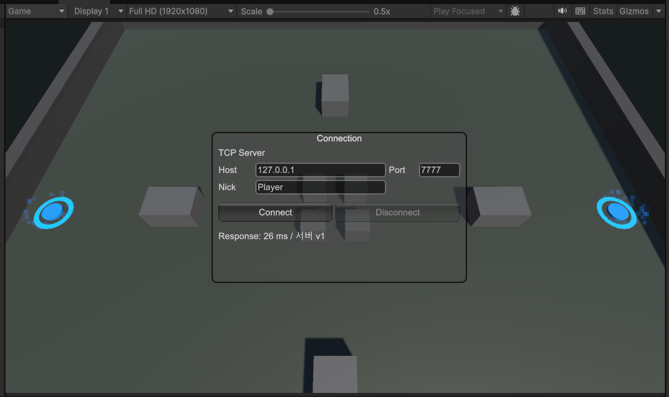
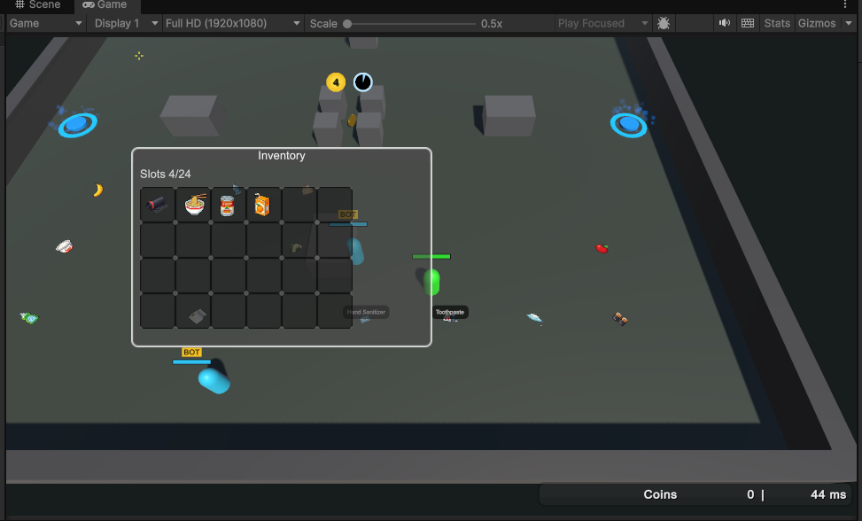
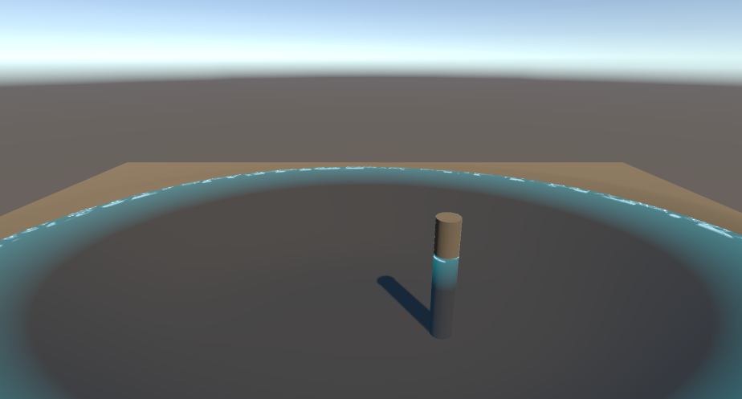

# unity6codex

앞으로 코덱스를 이용해 유니티 6.3 기능을 구현하는 테스트용 프로젝트입니다.

## 미리보기

### 탑다운 슈터 MVP

### 쇼어라인 실험

현재 구현:
- Unity 6 + .NET 10 기반 TCP 멀티플레이 탑다운 슈터 MVP
- 서버 권위 전투, 코인 드랍/획득, 상점/포탈, 리스폰
- 아이템 드랍과 인벤토리 UI
- 성장 트리 UI와 로컬 진행도 저장
- 맵 부트스트랩, 로컬 서버/봇 실행 도구
- Terrain Mesh, Water Shoreline, UI Toolkit 실험용 랩 씬
